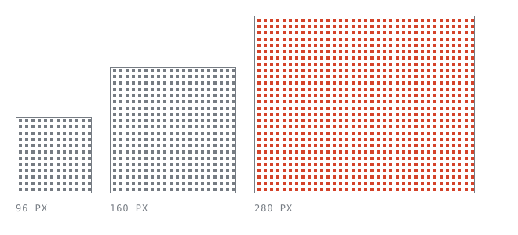

The portrait at the top of this site is a ten-second webcam clip redrawn as
square dots on a regular grid — one hard decision per cell, every frame, for as
long as it is on screen. What ships is the recording. The dots are cut in the
browser at the size the element actually is.

That last part is the whole design. A recording *of* the dots would be a bitmap
of squares, and a bitmap of squares is the one thing you cannot resize: scale it
up and every dot blurs or doubles unevenly, scale it down and the grid moirés
against itself. Because the grid is re-cut rather than scaled, one file serves a
96px chip and a full-bleed banner with the dots the same size in both.



## Why an ordered matrix

The obvious choice is error diffusion — Floyd–Steinberg is what everyone reaches
for, and on a still image it is better. On video it falls apart, for a reason
that only shows up once the picture moves.

An error-diffusion kernel decides each cell from the error carried out of the one
before it. Every cell therefore depends on every cell above and to the left of
it, which means a hair of movement anywhere re-decides the entire grid. The
texture boils between frames: dots crawl in passages that never moved.[^1]

An ordered matrix has no such dependency. The threshold is a fixed lookup, so the
same passage dithers to the same dots whatever else is happening in the frame —
and, just as usefully, whatever size the plate is being cut at.

> Stability under a size change and stability in time turn out to be the same
> property. Both are asking whether a cell's decision depends on its
> neighbours', and with a fixed matrix it never does.

## The interface

Drop it in, size it in CSS. That is the entire API — there is no width prop,
because the component reads the box it was given.

```jsx title="src/components/Intro.jsx"
<DitherVideo
  src={clip}
  className="size-[100px] shrink-0 -scale-x-100"
  cell={2}
  fps={8}
  raster={240}
/>
```

Three of those numbers are worth explaining:

- `cell` is the dot pitch in CSS pixels, and it is the biggest single look
  control. It is set to the same value the static plates use, so a clip beside
  one reads as the same material.
- `fps` is how often the grid is recut, not the clip's own frame rate. Twelve to
  fifteen is where a 1-bit texture stops reading as a slideshow and starts
  reading as film; sixty costs four times as much for a difference that is not
  visible through a grid this coarse.
- `raster` is how much of each frame is read back before it is averaged down
  into cells. This is the one that actually mattered.

## Reading back nine times more than you need

A player 100px wide at `cell` 2 decides fifty dots across. The engine's default
readback is 480px on the long edge, which is honest work for a player filling a
wide box — and, for a 100px chip, nine times the pixels for detail that is
thrown away in the very same pass. Every frame, for as long as the clip is on
screen.

Matching `raster` to the source means each frame is read at the size it was
stored and nothing is resampled twice.

## The file, too

The master is a 720×540 webcam recording: 3.4MB of VP9, shipped whole to draw a
fifty-dot square. It was the first thing a visitor waited on.

What ships now is a derivative cut to the job — the same centre square the
`cover` fit was already showing, at the resolution the dot grid can actually
spend, and as H.264 rather than VP9 so the Safaris that never learned to read
WebM stop drawing an empty box.[^2]

```bash title="Regenerating the masthead clip"
ffmpeg -i src/assets/dither-source-2.webm -an \
  -vf "crop=540:540:90:0,scale=240:240:flags=lanczos,fps=24" \
  -c:v libx264 -profile:v baseline -pix_fmt yuv420p -crf 30 -g 48 \
  -movflags +faststart src/assets/avatar.mp4
```

50KB, from 3.4MB. The 240 is not arbitrary: it is the `raster` value above, so
raising one means raising the other.

## What was left on the table

The clip is still imported by a component, which means nothing asks for it until
the bundle has arrived and React has mounted — the file waits in line behind the
code that names it. Fixing that is a separate problem, and a separate note.

[^1]: Worth seeing rather than taking on trust: run the same clip through
    Floyd–Steinberg at 15fps and watch a flat wall.
[^2]: Safari has supported WebM since 14.1, but only in the containers and on the
    hardware it feels like — which in practice means testing it rather than
    reading the table.
